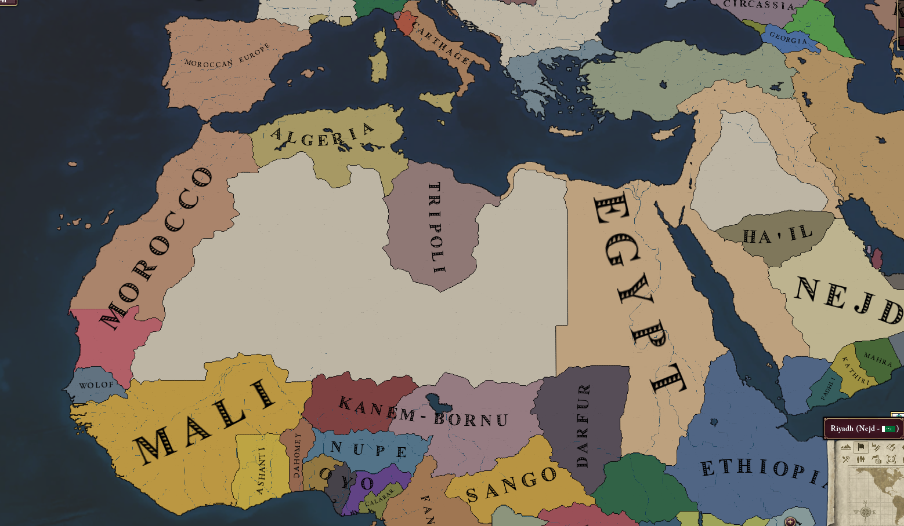
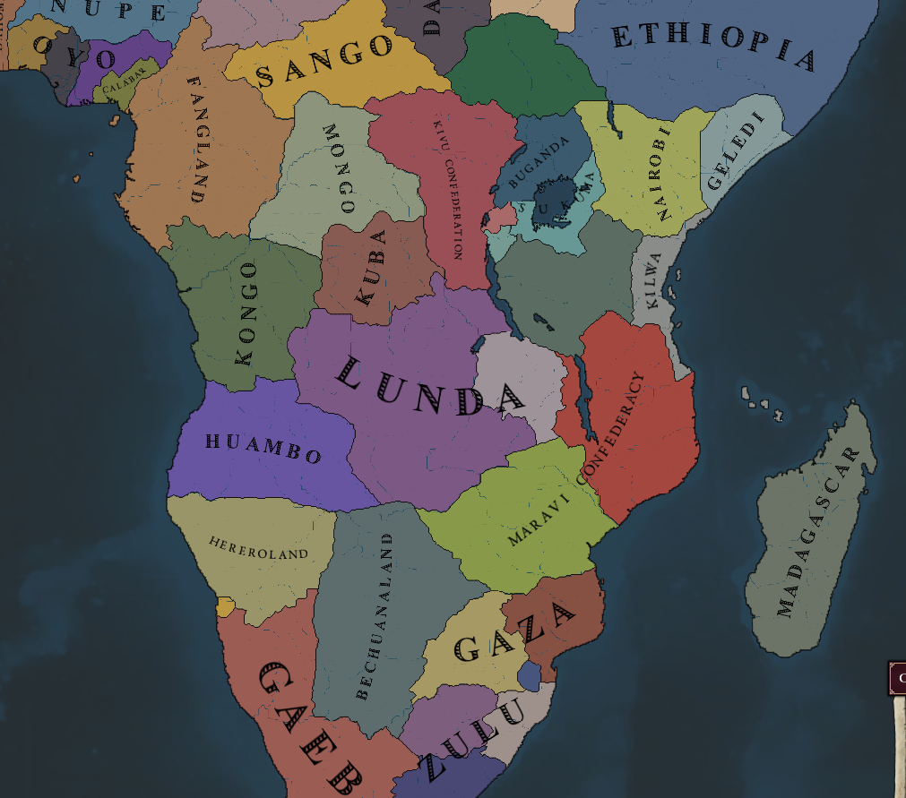
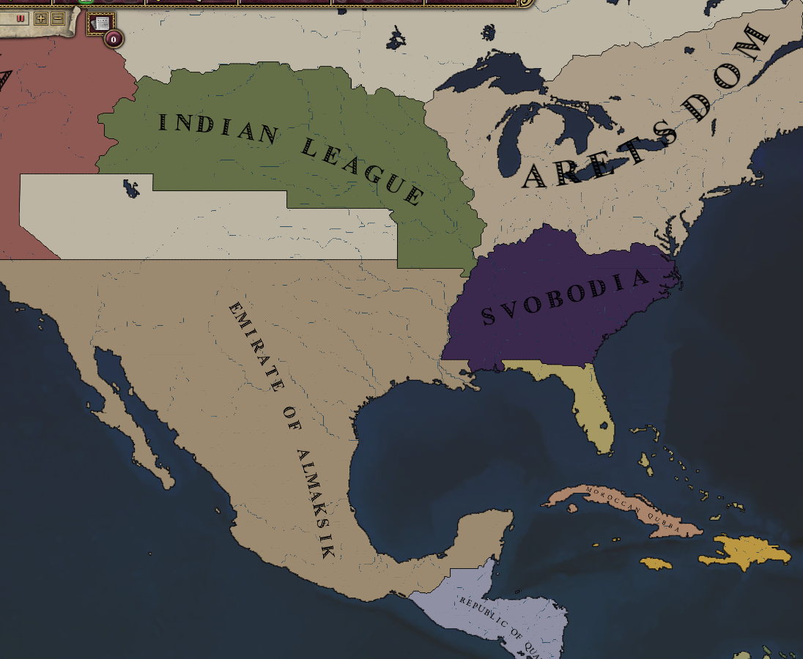
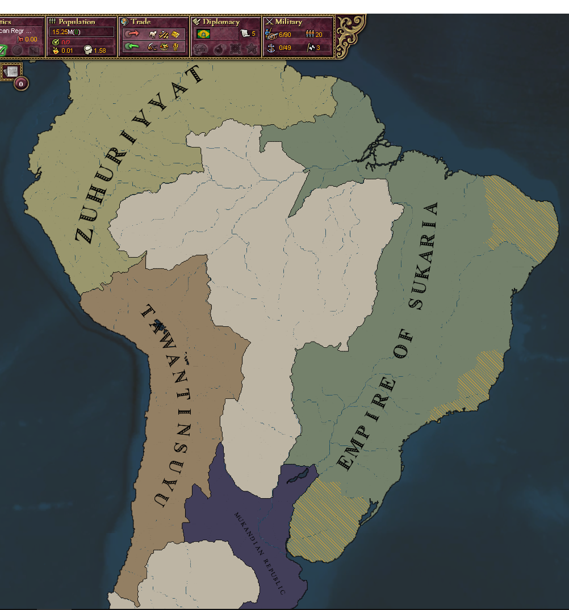
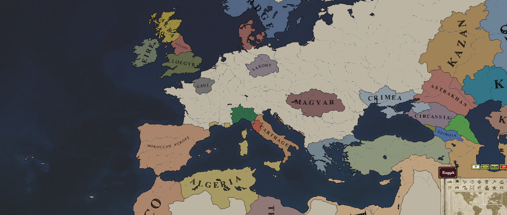

# Dawn of the Forgotten
This is the repository for the Victoria 2 mod **Dawn of the Forgotten**

## Introduction

### Lore

### Map

<b>Click to see the maps</b>

#### North Africa

#### South Africa

#### North America

#### South America

#### Europe

## Installation

1. Go to the [Latest Release](https://github.com/maxioten/dawn-of-the-forgotten/releases/latest) page and download the `.zip` file.
2. Extract the contents into your Victoria 2 `mod` directory:
   * **Steam path:** `C:\Program Files (x86)\Steam\steamapps\common\Victoria 2\mod`
3. Enable **Dawn of the Forgotten** in the Victoria 2 launcher and play!

## Contribution

To contribute to this project refer to the [Contribution guidelines](docs/CONTRIBUTING.md)